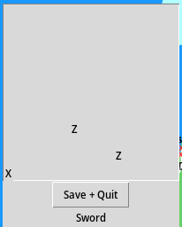

# ZAttack

**ZAttack**, short for Zombie Attack, is a game and a very old legacy project which I did when I was in high school (or rather, its equivalent). I am doubtful that I will maintain this project to anything more than the bare minimum.



## But why?

To have fun.

## Dependencies

- Python3
- Tkinter
	- In case you use Linux: Tkinter does not run natively on Wayland. Make sure to have Xorg or Xwayland installed.
	- Tkinter also requires Tcl.
- Computer with multi-threading capability.

## Run

To start a new game, run:

```bash
./new-game.py
```

To play, run:

```bash
./z-attack.py
```

## Usage

To move the player character (the "X"), use WASD. Hitting `q` will result in saving the program state and exiting the program. The sword is not functional as of now.
